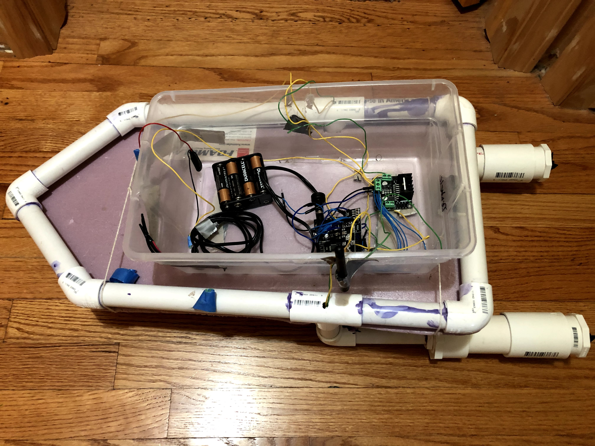
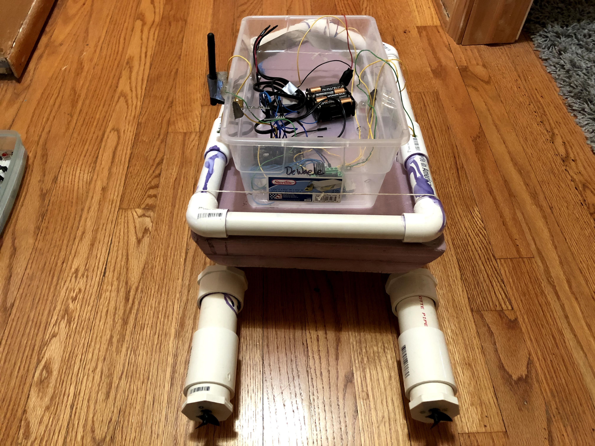
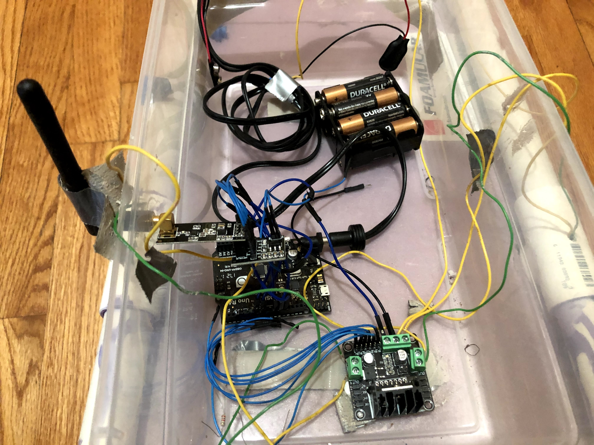
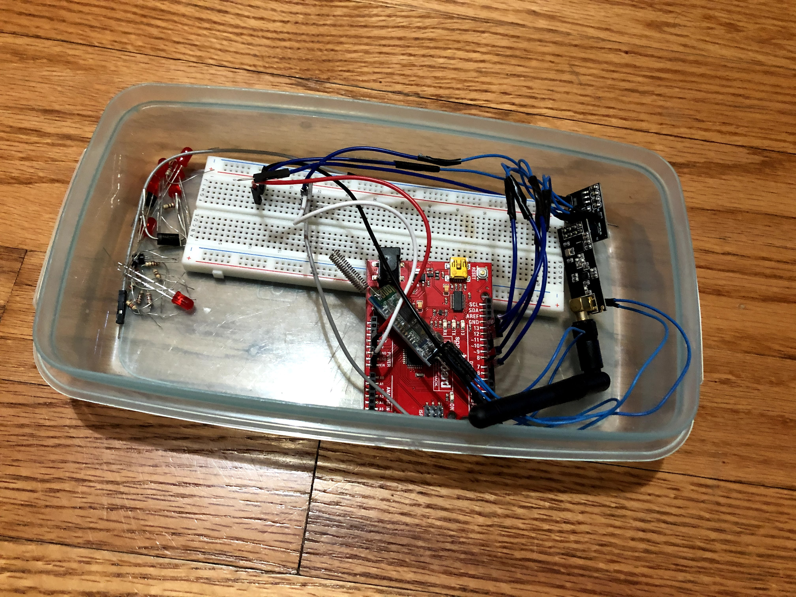

[Home](https://mdewaele25.github.io/)

# RC_boat
This was a project in which I built and programmed a remote controlled boat from scratch during the summer of 2019.

There were no specific goals or requirements I had in mind for this boat, more of an experimentation and expression of my knowledge.
The boat itself had a single Arduino Uno onboard for processing, while the remote controller was another Arduino Uno that received signals via an Android app.

The transmitting uno communicated via hc-05 bluetooth module to the Android device.  The two Unos communicated via 433 MHz RF modules.  The onboard Uno had a motor driver connected to two 12V DC motors.  The boat was constructed using a PVC frame with a foam base.  The Android app output had a throttle and angle controller, although much noise was also generated from the third party app.  This required lots of data parsing required to get readable data.  The transmitter sent the corresponding values to the receiver, which utilized the conditionals for speed and angle to correctly power the motors.

The boat could operate in any gentle water up to a range of roughly 40-50 feet.  It could make sharp enough turns to make a circle with radius 3-4 feet.  It's top speed was 2 miles per hour.

Future improvements are to install larger motors to increase the top speed, improve the robustness of the transmitter and receiver to allow for a farther operational range, and overall improve the water-proofing onboard the boat.

Additionally, there was occasional signal loss which resulted in a complete loss of control of the boat.  This was investigated thoroughly, but was never fixed.  This will need to be fixed before taking the boat in larger bodies of water.

[Link to a short video](https://youtu.be/q16YMKoBCYA)
This video is a short demonstration of the capabilities of the boat.  The boat was tested in a pool before being taken to a small pond once condifence and robustness was increased to a comfortable level.  At the end of the video you can see that my partner is holding his Android device that was using an app to control the boat.  While we still upgraded the boat for several weeks after this video was taken, the video is a fair assessment of the final performance of the boat.   

 

 

 

 

